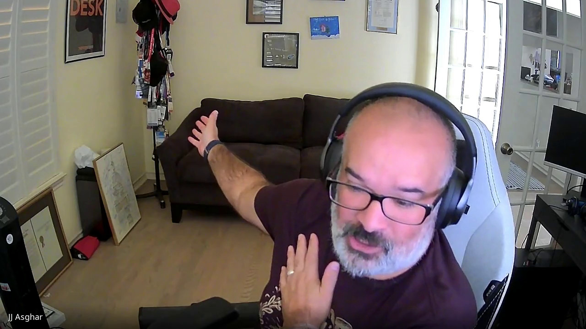

---
host:
  image: NW_2.jpg
  name: Nathan Willis
int:
  image: JA.jpg
  name: JJ Asghar
date: 2025-09-23
description : "Texas Linux Fest 2026 - Interview: JJ Asghar x Nathan Willis"
draft : false
layout: "interview"
ignore_header: true
---
# JJ Asghar on AI, ethics, and evening plans

> This is the second in our series of informal chats with long-time
> Texas Linux Fest participants. We'd call them "friends of TXLF" but
> that might imply that there are folks out there who aren't
> considered friends, and we know that just isn't the
> case. Regardless, if you missed the previous interview, you can find
> it [here](https://2026.texaslinuxfest.org/interviews/thomas-cameron/).

[JJ Asghar](https://2026.texaslinuxfest.org/speakers/jj-asghar/) works in developer advocacy at IBM, covering a wide swath of
software projects and communities. He's been an enthusiastic supporter
of Texas Linux Fest along the way, so I wanted to ask him about what
being at the event means to people who live and breathe open-source
Monday-through-Friday, 9-to-5.

But I had to start with the obvious, which is that the two of us met
by sheer coincidence at an airport by spotting our FOSS event
paraphernalia.

  
### Interview

  

__Nate__: "I remember we first met kind of randomly, then have crossed
paths a few times since, but never really hung out ... so I don't
actually think I know what your job is."

__JJ__: "I came in as a developer advocate about seven years ago, when
developer advocacy was really, really important to so many
companies. Because they wanted to hit the ground running, they
leveraged my skill set and my connections to basically get IBM to
tables that it normally couldn't get to. 'JJ, go be yourself and make
IBM look good' — that's basically what I was told to do.

Over time, my job has morphed from that. I own our github.com,
basically. It's handwavy, not official, but for all open source when
IBM open sources something, I am one of the gatekeepers before it
leaves, if you will. Basically I'm the funnel."

__Nate__: "That sounds like 'a lot of different teams' to me and, I'm
assuming, they maybe don't all know each other."

__JJ__: "One hundred percent. I become air traffic control, because I know
anyone from the CISO suite for security incidents to the kernel
developers over in the z space. I need to be able to find
opportunities for companies or people who completely don't know each
other realize that they're actually trying to solve the exact same
problem."

__Nate__: "For a company like that, with that many things cooking, what's
useful about a community event?"

__JJ__: "One of the things we do that competitors don't do is we show up
day-in and day-out. We don't yell it from the mountain tops. I'm
coming in as a speaker who's just going to show you some cool s***. I
find it's where I'm empowered to go explore in these spaces and give
back to the community that has helped me so much."

__Nate__: "About that community, do you remember when you first heard
about Texas Linux Fest?"

__JJ__: "All the way back in my Chef days; that was when I started going
to events. Before I was at Chef, I was at a couple of startups in
Austin, but I didn't spend a lot of time in the meetup space. But I
knew of Texas Linux Fest, and I always aspired to speak there, because
at the time I was training myself through the skill sets that I needed
to build my career.

Texas Linux Fest was a pinnacle event for the communities I was
in. The first version of Linux that really stuck with me was a version
called [Crux](https://crux.nu/). It was the only one I could get
working on my desktop at the time. It's a really stripped down version
of Linux. The package management system is done with a BSD style port
tree. So all the installation process you can see is basically a Bash
script: you can actually see how everything is done and you really
learn how to build things from scratch and all that. I came up through
that path. I took the hard mode; what can I say?"

__Nate__: "I want to ask you about your talk, [Using Open Source AI and
Linux to help Medical School
Students](https://2026.texaslinuxfest.org/talks/using-open-source-ai-and-linux-to-help-medical-school-students/). What's
PETE?"

__JJ__: "So doctors have really s****y bedside manner. It turns out, if
you didn't know, that doctors only get one class in medical school to
learn bedside manner. And what they do is hire actors to come in and
act, and you get to interact with them. But this is one class, out of
multiple years of becoming a doctor.

What I did with PETE is I built a really simple front end to an AI
model that gives different situations. PETE tries to emulate those
things, so doctors can practice. It's through text right now, but it's
a proof of concept. And it's all local on your laptop. You can do it
on a plane if you need to.

The best part is, it can grow, right?. Like, you can easily pull in a
RAG of specific health issues that you are looking for. I actually
have a medical school in the Bay Area that has put this in front of
some of their students. Of course, it's a first pass and it's not
great by any standard, but it's enough for them to realize 'oh wow; I
can actually work with this and I can get the engagement that I'm
looking for.'"

__Nate__: "So what led you down this path? What was the inciting incident
to do it? Because you're not a doctor, right?"

__JJ__: "No... I'm barely a college graduate! Actually, IBM is a really
large company. We have a lot of fingers in a lot of different
pies. And one of the marketing people, her sister-in-law is a dean for
a medical school. They were just literally talking over dinner one day
saying how crappy this situation is. And she was the marketer for Granite,
which is the open source model we're doing. And she's like, 'You know what? I
bet I could find someone to figure out how to do this.'

And literally one Slack message later, I was like, 'Oh, yeah;
sure. I'll make this happen.' I coded it out over a couple of weeks to
the point where I was able to actually bring in students."

__Nate__: "Another thing that I noticed in your abstract was you mention
the ethical perspective; building trust and stuff like that. I know,
and you probably know too, there's a lot of people in the broader
open-source world who feel very irritated at the AI hype these
days. And a lot of that — I think — is because they perceive this
ethical disconnect where, for example, companies are scraping open
source code and then _not sharing_ what they have derived from
that. 

How would you frame this work in terms of those ethical questions for
people who may come in with a little trepidation or concern?"

__JJ__: "Yeah; absolutely 100 percent. Rolling it back to my introduction,
I work for IBM; what we've done is our models admittedly aren't the best
compared to the proprietary ones out there. But I can give you the full data
set, all the weights, and the papers on how the models were created.

And we have the lawyers that are going to go to court with you to back
you up to say that all the code inside of the model is attributed
correctly. We will put our lawyers in court with you to say that we
absolutely agree that this is completely valid open-source work that
our data sets are."

__Nate__: "There's the headline for you: free lawyers!"

__JJ__: "Exactly! But in all seriousness, the challenge is — and this
boils down back down to the same conversation we've been having for
the last 20 years about proprietary versus open source — the
proprietary ones are frankly better, but they're also Napster, right?
They're also stealing all of this information from everybody. We're
actually trying to build iTunes, right? Not the marketplace aspect of
it, but the idea that there are protections inside of it, and you can
actually be legal in this space."

__Nate__: "What should somebody bring into your talk? Are you
going to need to know some baseline stuff?"

__JJ__: "What I've learned going through this ecosystem is there's a
lot of people who have preconceived notions of AI and how it all works. So I
actually start at the very beginning and I kind of give a nice overview of
everything and then bring it up to PETE.

So, you can come in with no knowledge whatsoever. Or you can be a data
scientist. I'm telling you the story on how to get to this thing, then
showing you the art of the possible. And I have a couple other
projects if we get through too quickly."

__Nate__: "What else are you looking forward to this year at Texas Linux
Fest? Has anything really stuck out to you?"

__JJ__: "I have a handful of friends who are going to be there. So I'm
very, very excited to come back. One of the best things about Texas
Linux Fest is that it's a yearly summer camp for me, in a lot of ways,
where I get to see people I don't get to normally see on the road or
whatever.

I do love these-style events more than the big flashy conferences that
I have the privilege of going to, because the people who show up at
these are so much more genuine and they actually are passionate about
'the thing' and I can sit there and spend 45 minutes talking about my
Vim bindings.

And the best part, too, is it's more-or-less right down the street
from my house now, which is really, really fun. So, I'm excited."

__Nate__: "I've never had a conference where I slept in my own house and
drove there in the morning. How is that different? Does it feel like
you're not at a conference? Or does it feel like people are coming to
visit you, or what?"

__JJ__: "It is a weird paradigm shift. I've done this a handful of times
throughout my career. And I'll tell you, as I've grown older ... I
have two daughters. I'm a girl dad. And my girls have obviously grown
as I've done this career, I guess. And it's interesting to see, as
they've gotten older, the dad feelings of me wanting to come home
early is actually much stronger.

If I go to an event here in town and I just drive and I sleep in my own
bed and I leave again and my girls are young, they just go to school
and, you know, it's not a big thing. It's like hanging out with your
buds, right?

As I've gotten older and they start doing more activities or things like
softball, for instance, I have to choose. Like, 'oh, she's going to go to
the batting cages at 6 PM.' Okay. Well, I need to be there to because
I help coach her, right? I need to be there so I show that my priority
is my daughter."

__Nate__: "That is a really good point. I don't think I've heard anyone
articulate that before, about the value of a local community event. Or,
maybe, we focus on 'people who can't travel around the country' just for
budgetary or time reasons. But yeah, you get your keep your life
rolling too."

__JJ__: "Exactly. I get to be the nerd during the day and then, in the
evening, admittedly I don't get to hang out at the bar and get into
real, real deep nerdy stuff. But I get to be the dad at night."

__Nate__: "That's pretty nice. Is there anything else you'd like to say
about what the experience will be this weekend?"

__JJ__: "Honest truth? Texas Linux Fest is really high up there on my
charts of places to go." _[points behind him]_ "You won't be showing
this, but those are the ones I've spoken at, and Texas Linux Fest is
always one I submit to."

__Nate__: "JJ's pointing at a whole bunch of lanyards over his
houlder. Maybe we'll make that the interview screenshot, if that's
okay with you."

__JJ__: "Absolutely. I have so many friends and colleagues from
there and I feel genuinely privileged to be part of your community."

 
 
You can hear JJ's exploration of open-source AI, its ethical
dimensions, and working with medical students at Texas Linux Fest
2026, November 6 to 7. But we all have to promise not to keep him out
too late.
